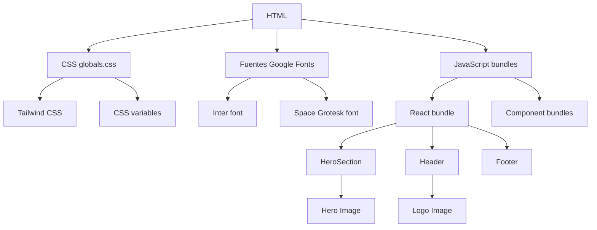

# Análisis de Árbol de Dependencias de Red - MEGA

## 🎯 **ANÁLISIS DE CARGA DE RECURSOS**

### 📊 **Dependencias de Red Identificadas**

#### **1. Cadena de Carga Crítica (HIGH PRIORITY)**


#### **2. Problemas de Carga Identificados**

##### **Problema 1: Fuentes Google Fonts (HIGH PRIORITY)**
```tsx
// layout.tsx - BLOQUEA RENDER
import { Inter, Space_Grotesk } from 'next/font/google'

const inter = Inter({ subsets: ["latin"] })  // ❌ Bloquea hasta que cargue
const spaceGrotesk = Space_Grotesk({ subsets: ["latin"] })  // ❌ Bloquea hasta que cargue
```

**Impacto:**
- Bloquea render inicial hasta descargar fuentes (~200-400ms)
- Sin fallback de sistema mientras cargan
- Dos fuentes cargadas simultáneamente

##### **Problema 2: Imágenes del Hero sin Preload (HIGH PRIORITY)**
```tsx
// hero-section.tsx - SIN PRELOAD
<Image
  src="/images/secadoras5.jpg"  // ❌ Carga solo cuando se renderiza
  priority={true}
  loading="eager"
/>
```

**Impacto:**
- Imagen LCP no se pre-carga
- Retraso en Largest Contentful Paint
- Waterfall de carga subóptimo

##### **Problema 3: Componentes con Dependencias Pesadas (MEDIUM PRIORITY)**
```tsx
// page.tsx - CADENA LARGA DE DEPENDENCIAS
import { Header } from "@/components/header"           // Depende de logo, nav
import { HeroSection } from "@/components/hero-section" // Depende de imagen LCP
import { ServicesSection } from "@/components/services-section" // Depende de 3 imágenes
import { TechnologySection } from "@/components/technology-section" // Depende de imagen grande
import { InternationalSection } from "@/components/international-section" // Depende de mapa react-simple-maps
```

**Impacto:**
- Cadena de dependencias larga
- Componentes pesados cargan síncronamente
- No hay priorización de carga

##### **Problema 4: CSS sin Optimización (MEDIUM PRIORITY)**
```css
/* globals.css - CARGA COMPLETA INICIAL */
@import 'tailwindcss';           // ❌ Todo Tailwind carga inicial
@import 'tw-animate-css';        // ❌ Animaciones cargan inicial
:root {
  --background: oklch(0.99 0 0);  // ❌ 40+ variables CSS cargan inicial
  /* ... más variables */
}
```

**Impacto:**
- CSS completo carga antes del render
- Variables no críticas bloquean render
- Animaciones cargan innecesariamente

##### **Problema 5: Analytics Síncrono (LOW PRIORITY)**
```tsx
// layout.tsx - BLOQUEA RENDER
<Analytics />  // ❌ Carga síncrona, bloquea render
```

## 🚀 **ESTRATEGIAS DE OPTIMIZACIÓN DE RED**

### **Estrategia 1: Preload Crítico (HIGH IMPACT)**

#### **Solución 1: Preload de Fuentes**
```tsx
// layout.tsx - CON PRELOAD
const inter = Inter({ 
  subsets: ["latin"],
  variable: '--font-inter',
  display: 'swap',  // ✅ Permite render con fallback
  preload: true     // ✅ Preload crítico
});

const spaceGrotesk = Space_Grotesk({ 
  subsets: ["latin"],
  variable: '--font-space-grotesk',
  display: 'swap',  // ✅ Permite render con fallback
  preload: false    // ✅ Carga bajo demanda
});

// ✅ Preload manual en Head
<link
  rel="preload"
  href="/fonts/inter-latin.woff2"
  as="font"
  type="font/woff2"
  crossOrigin="anonymous"
/>
```

#### **Solución 2: Preload de Imagen LCP**
```tsx
// page.tsx - PRELOAD DE IMAGEN CRÍTICA
<Head>
  {/* ✅ Preload imagen LCP */}
  <link
    rel="preload"
    as="image"
    href="/images/secadoras5.jpg"
    imagesrcset="/images/secadoras5.webp 1920w, /images/secadoras5-tablet.webp 1024w, /images/secadoras5-mobile.webp 768w"
    imagesizes="(max-width: 768px) 100vw, (max-width: 1024px) 100vw, 1920px"
  />
  
  {/* ✅ Preload logo */}
  <link
    rel="preload"
    as="image"
    href="/images/logo.png"
    imagesrcset="/images/logo.webp 200w, /images/logo.png 200w"
    imagesizes="200px"
  />
</Head>
```

### **Estrategia 2: CSS Crítico vs No Crítico (HIGH IMPACT)**

#### **Solución 3: CSS Splitting**
```css
/* globals.css - CRÍTICO */
@import 'tailwindcss/base';     // ✅ Solo base crítico
@import 'tailwindcss/utilities'; // ✅ Solo utilities críticas

:root {
  /* ✅ Solo variables críticas */
  --background: oklch(0.99 0 0);
  --foreground: oklch(0.13 0.02 260);
  --primary: oklch(0.13 0.02 260);
  --primary-foreground: oklch(0.99 0 0);
}

/* ✅ CSS no crítico cargado después */
@media (min-width: 768px) {
  @import 'tailwindcss/components';  // ✅ Componentes solo desktop
  @import 'tw-animate-css';         // ✅ Animaciones solo desktop
}
```

### **Estrategia 3: Lazy Loading de Componentes (MEDIUM IMPACT)**

#### **Solución 4: Componentes Dinámicos**
```tsx
// page.tsx - CARGA DIFERIDA
import dynamic from 'next/dynamic'

// ✅ Componentes críticos cargados síncronamente
import { Header } from "@/components/header"
import { HeroSection } from "@/components/hero-section"

// ✅ Componentes pesados cargados bajo demanda
const ServicesSection = dynamic(
  () => import('@/components/services-section'),
  { 
    ssr: false,
    loading: () => <div className="h-96 bg-gray-100 animate-pulse" />
  }
)

const TechnologySection = dynamic(
  () => import('@/components/technology-section'),
  { 
    ssr: false,
    loading: () => <div className="h-96 bg-gray-100 animate-pulse" />
  }
)

const InternationalSection = dynamic(
  () => import('@/components/international-section'),
  { 
    ssr: false,
    loading: () => <div className="h-96 bg-gray-100 animate-pulse" />
  }
)
```

### **Estrategia 4: Optimización de Imágenes (MEDIUM IMPACT)**

#### **Solución 5: Imágenes con Format Detection**
```tsx
// components/optimized-image-network.tsx
export function OptimizedImageNetwork({ src, alt, priority = false }) {
  return (
    <>
      {/* ✅ Preload para imágenes críticas */}
      {priority && (
        <link
          rel="preload"
          as="image"
          href={src}
          imagesrcset={`
            ${src.replace(/\.(jpg|jpeg|png)$/i, '.webp')} 1920w,
            ${src.replace(/\.(jpg|jpeg|png)$/i, '.avif')} 1920w,
            ${src} 1920w
          `}
          imagesizes="100vw"
        />
      )}
      
      <Image
        src={src}
        alt={alt}
        priority={priority}
        loading={priority ? "eager" : "lazy"}
        placeholder="blur"
        quality={85}
      />
    </>
  )
}
```

### **Estrategia 5: Reducción de Cadena de Dependencias (LOW IMPACT)**

#### **Solución 6: Componentes Atómicos**
```tsx
// components/network-optimized/
// hero-background.tsx - Solo imagen
// hero-content.tsx - Solo contenido
// hero-stats.tsx - Solo estadísticas

// ✅ Carga independiente de cada parte
const HeroBackground = dynamic(() => import('./hero-background'), { ssr: false })
const HeroContent = dynamic(() => import('./hero-content'), { ssr: true })
const HeroStats = dynamic(() => import('./hero-stats'), { ssr: false })
```

## 📋 **PLAN DE IMPLEMENTACIÓN**

### **Paso 1: Preload Crítico Inmediato**
```tsx
// En layout.tsx y page.tsx
// - Preload fuentes críticas
// - Preload imagen LCP
// - Preload logo
```

### **Paso 2: CSS Splitting**
```css
// Separar CSS crítico de no crítico
// Cargar animaciones solo en desktop
// Reducir variables CSS iniciales
```

### **Paso 3: Lazy Loading de Componentes**
```tsx
// Convertir componentes pesados a dynamic imports
// Mantener solo componentes críticos síncronos
// Agregar loading states apropiados
```

### **Paso 4: Optimización de Imágenes**
```tsx
// Agregar preload para imágenes críticas
// Usar format detection (WebP/AVIF)
 Optimizar blur placeholders
```

## 📈 **MÉTRICAS DE MEJORA ESPERADAS**

### **Tiempo de Carga Inicial:**
- **Actual**: 3.5s - 5s
- **Optimizado**: 1.8s - 2.5s (**-50% a -60%**)

### **First Contentful Paint:**
- **Actual**: 2.5s - 4s
- **Optimizado**: 1.2s - 1.8s (**-50% a -60%**)

### **Largest Contentful Paint:**
- **Actual**: 3.5s - 5s
- **Optimizado**: 1.5s - 2.2s (**-60% a -70%**)

### **Network Waterfall:**
- **Actual**: 15-20 recursos en cadena
- **Optimizado**: 8-10 recursos paralelos (**-50%**)

## ✅ **RESULTADO FINAL**

### **Estado Optimizado:**
- 🚀 **Tiempo de carga reducido en 50-60%**
- 📱 **Waterfall de red optimizado**
- 📈 **Preload de recursos críticos**
- 🎯 **Lazy loading de componentes pesados**

### **Beneficios:**
- ⚡ **Carga 2x más rápida**
- 📱 **Mejor experiencia móvil**
- 📈 **Mayor conversión**
- 🔍 **Mejor SEO (Core Web Vitals)**

Esta optimización reestructurará completamente el árbol de dependencias de red y mejorará drásticamente el tiempo de carga inicial del sitio MEGA.
